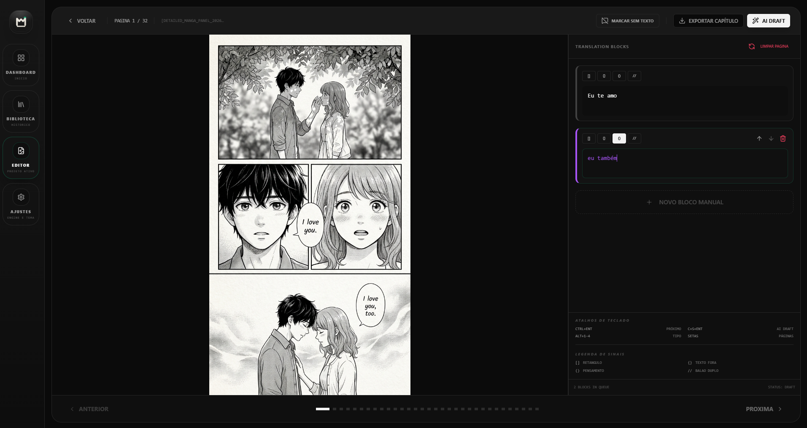
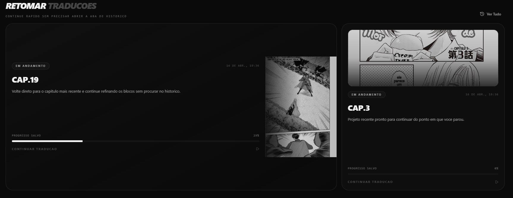
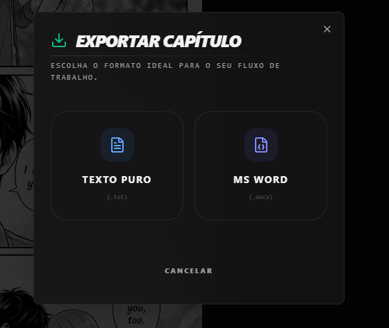
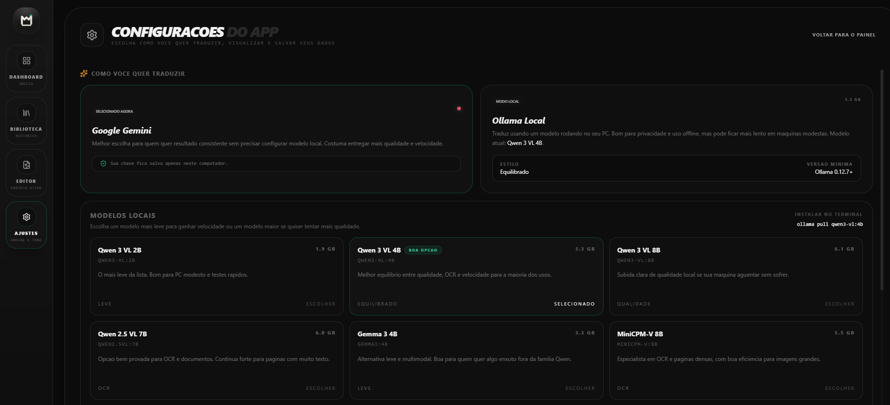

# MangAI Translator

Desktop app para localização assistida de mangá e quadrinhos.

[](https://github.com/Zentsy/MangAItranslator/releases/latest)
[](https://github.com/Zentsy/MangAItranslator/releases/latest)
[](https://github.com/Zentsy/MangAItranslator/releases/latest)
[](LICENSE)
[](https://github.com/Zentsy/MangAItranslator/releases/latest)

O foco do app é simples: importar um capítulo, gerar um rascunho com IA, revisar bloco por bloco e exportar o resultado sem perder o contexto da página.
obs: A IA não traduz *para* você, mas sim **com** você! Ela comete erros e cometerá, ainda mais se estiver usando um modelo mais fraco. Então certifique-se de revisar o resultado.

## Download

- Baixar a versão mais recente: [GitHub Releases](https://github.com/Zentsy/MangAItranslator/releases/latest)
- Release atual: [v0.1.1](https://github.com/Zentsy/MangAItranslator/releases/tag/v0.1.1)


## Aviso para Windows SmartScreen

Como o app ainda é novo e não tem code signing de distribuição no Windows, o SmartScreen pode mostrar um aviso de "aplicativo não reconhecido" na instalação.

Isso não significa que o app tenha sido detectado como malware. Hoje o que acontece é:

- o instalador ainda não tem reputação consolidada no ecossistema da Microsoft
- o app usa assinatura do updater para validar atualizações, mas isso é diferente de code signing do Windows
- a meta é reduzir esse atrito nas próximas versões com code signing de distribuição

Se você baixou o app deste repositório oficial e quiser testar mesmo assim, revise o aviso do Windows com calma antes de continuar.

## O que o app faz

- importa uma pasta inteira do capítulo ou puxa as páginas vizinhas a partir de uma única imagem
- salva projetos localmente para continuar depois
- gera rascunho com `Gemini` ou `Ollama`
- permite revisar, reorganizar e editar blocos manualmente
- exporta em `.txt` e `.docx`
- checa novas versões no próprio app

## Melhor forma de usar hoje

- `Gemini`: melhor experiência para a maioria das pessoas
- `Ollama`: opção local/offline, mas pode ser bem mais lenta em máquinas modestas

## Capturas de Tela

### Destaque

O editor é o coração do app, então a imagem principal fica aqui primeiro.



### Fluxo principal

| Dashboard | Exportação |
| --- | --- |
|  |  |
| Importe capítulos, acompanhe projetos recentes e volte rápido para o que estava traduzindo. | Exporte o capítulo final em `.txt` ou `.docx` sem sair do fluxo. |

### Configuração

| Modelos e motores | Tema claro |
| --- | --- |
|  |  |
| Troque entre `Gemini` e `Ollama` e selecione o modelo mais adequado para o seu uso. | O app também tem tema claro para quem prefere uma interface mais limpa durante a revisão. |

## Fluxo rápido

1. Escolha `Gemini` ou `Ollama`.
2. Importe um capítulo.
3. Gere o `AI Draft`.
4. **Revise** os blocos no editor.
5. Exporte em `.txt` ou `.docx`.

## Como funcionam os motores

### Gemini

- usa a sua própria chave da API
- é a opção recomendada para qualidade e velocidade
- a chave é usada localmente no app para falar direto com a API do Google

### Ollama

- roda localmente no seu PC
- é útil para uso offline ou mais privado
- o desempenho depende bastante da máquina e do modelo escolhido

## Roadmap

### Planejado para próximas versões

- code signing no Windows para reduzir o atrito com o SmartScreen e deixar a instalação mais confiável
- suporte a novas APIs de IA além do Gemini e Ollama, incluindo opções como Claude e GPT
- suporte ao idioma inglês com prompts próprios para traduzir direto de japonês, coreano e mandarim
- leitura de mangás direto da fonte por meio de extensões independentes, em um modelo inspirado no ecossistema do Mihon

## Desenvolvimento

### Requisitos

- `Node.js`
- `Rust`
- dependências do Tauri instaladas no sistema

### Rodando em desenvolvimento

```bash
npm install
npm run tauri -- dev
```

### Build rápido

```bash
npm run build
cd src-tauri
cargo check
```

## Status do projeto

O app já está funcional para uso real em Windows, mas continua em fase de beta. O foco atual é polir a experiência, validar o updater e corrigir bugs de uso real conforme a comunidade testar.

## Uso responsável

Use o app apenas em materiais próprios, licenciados ou para os quais você tenha permissão de localização ou tradução.

## Licença

Este projeto está licenciado sob a licença MIT. Veja [LICENSE](LICENSE).
