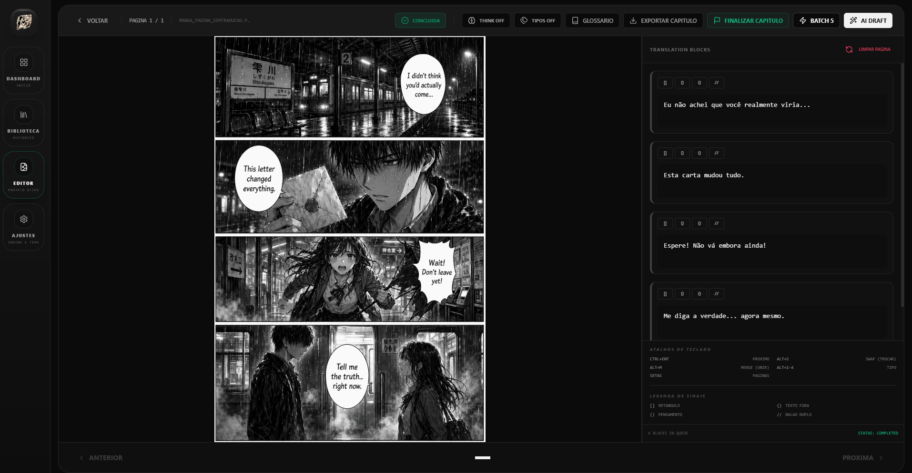
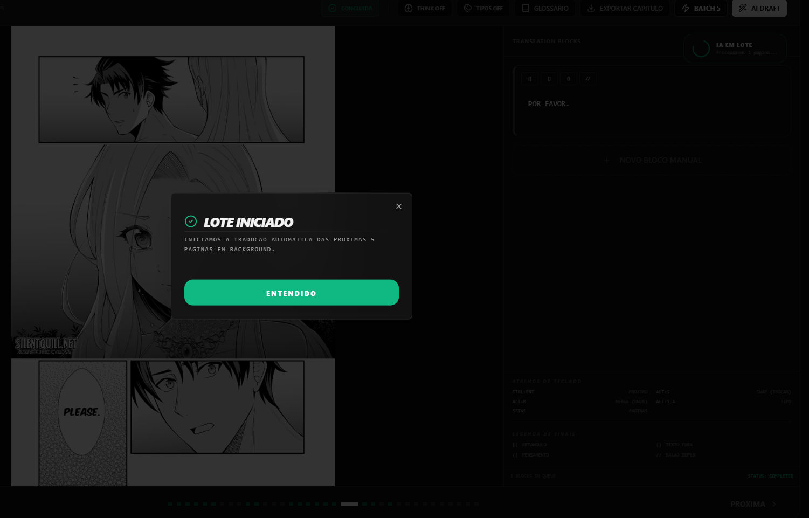
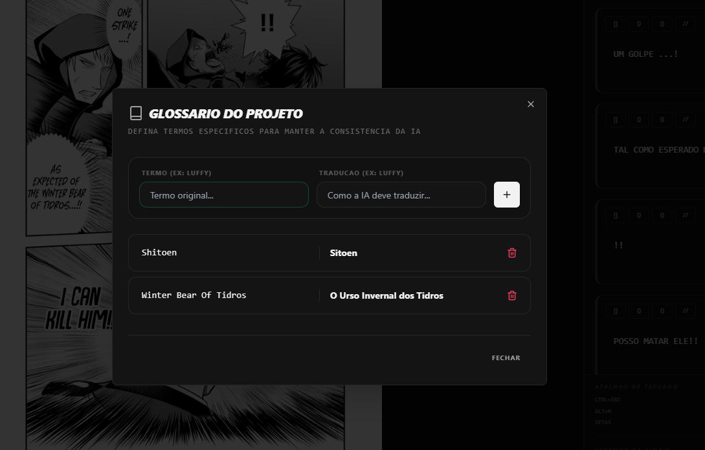
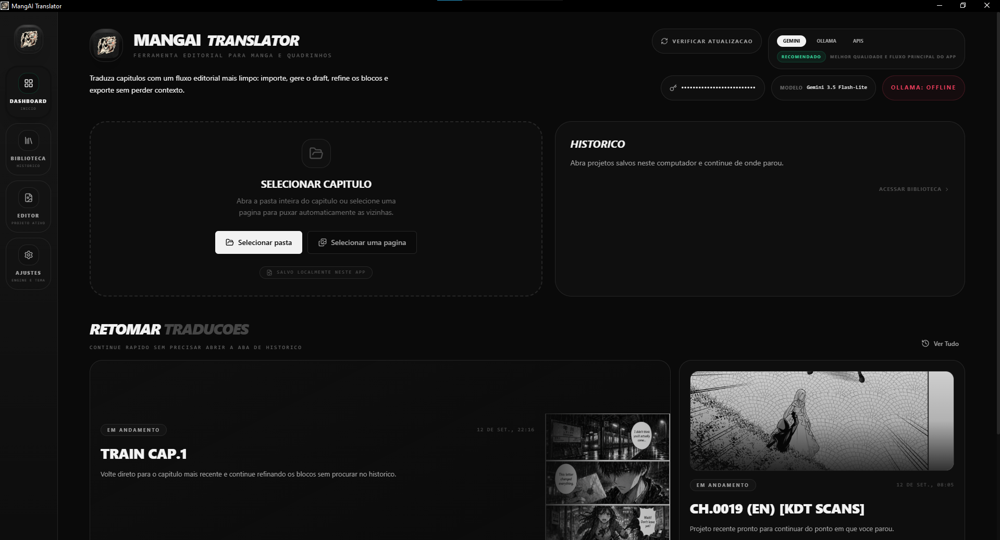
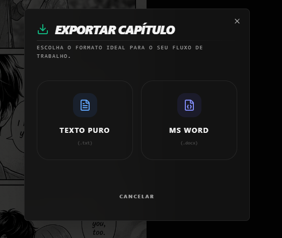
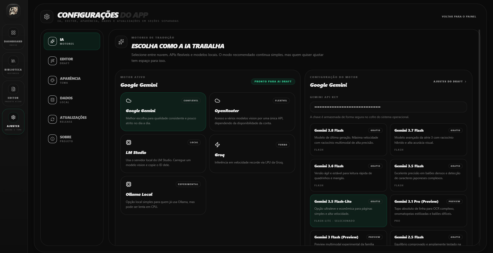

# MangAI Translator


Desktop app para localização assistida de mangá e quadrinhos.

<p>
  <a href="https://github.com/Zentsy/MangAItranslator/releases/latest">
    
  </a>
  <a href="https://github.com/Zentsy/MangAItranslator/releases/tag/v0.2.0">
    
  </a>
  <a href="https://ko-fi.com/zentsy">
    
  </a>
  <a href="LICENSE">
    
  </a>
</p>

O MangAI Translator ajuda você a importar um capítulo, gerar um rascunho com IA, revisar bloco por bloco e exportar o texto final sem perder o contexto da página.

> A IA traduz **com** você, não **por** você. Modelos podem errar, transcrever em vez de traduzir ou interpretar balões fora de ordem. Revise sempre antes de publicar qualquer tradução.

## Download

- Baixar a versão mais recente: [GitHub Releases](https://github.com/Zentsy/MangAItranslator/releases/latest)
- Release atual: [v0.2.0](https://github.com/Zentsy/MangAItranslator/releases/tag/v0.2.0)

Se o projeto te ajudar e você quiser apoiar o desenvolvimento, também dá para contribuir em [Ko-fi](https://ko-fi.com/zentsy).

## Aviso para Windows SmartScreen

Como o app ainda é novo e não tem code signing de distribuição no Windows, o SmartScreen pode mostrar um aviso de "aplicativo não reconhecido" na instalação.

Isso não significa que o app tenha sido detectado como malware. Hoje o que acontece é:

- o instalador ainda não tem reputação consolidada no ecossistema da Microsoft
- o app usa assinatura do updater para validar atualizações, mas isso é diferente de code signing do Windows
- a meta é reduzir esse atrito nas próximas versões com code signing de distribuição

Se você baixou o app deste repositório oficial e quiser testar mesmo assim, revise o aviso do Windows com calma antes de continuar.

## O que o app faz

- importa uma pasta inteira do capítulo ou puxa páginas vizinhas a partir de uma única imagem
- salva projetos localmente para continuar depois
- gera rascunhos com Gemini, OpenRouter, LM Studio, Groq ou Ollama
- permite revisar, reorganizar e editar blocos manualmente
- exporta em `.txt` e `.docx`
- checa novas versões pelo próprio app

## Motores de IA

### Recomendado

- `Gemini`: melhor experiência geral para qualidade, OCR e consistência.
- `Groq`: modo turbo para páginas leves; quando funciona bem, é quase instantâneo.
- `OpenRouter Auto grátis`: tenta modelos vision gratuitos em fila, sem usar modelos pagos automaticamente.

### Local

- `LM Studio`: melhor opção local hoje. Funciona com modelos carregados no LM Studio e pode usar GPU dependendo da sua máquina.
- `Ollama`: opção local simples e experimental. Pode ser bem mais lenta em CPU.

### Importante sobre modelos grátis

No OpenRouter, a qualidade depende do modelo gratuito disponível no momento. O app tenta corrigir respostas duplicadas, vazias ou mal formatadas, mas alguns modelos pequenos podem apenas transcrever o texto em vez de traduzir.

## Capturas de tela

### Destaque

O editor é o coração do app, agora com monitor de progresso em tempo real e tradução em lote integrada.



### Fluxo de Trabalho & Produtividade

| Tradução em Lote (Batch) | Glossário por Projeto |
| --- | --- |
|  |  |
| Enfileire múltiplas páginas e acompanhe o progresso em tempo real enquanto revisa. | Defina termos, nomes e golpes persistidos em SQLite injetados nos prompts. |

| Dashboard e Projetos | Exportação Editorial |
| --- | --- |
|  |  |
| Importe capítulos, acompanhe projetos recentes e volte rápido para o que estava traduzindo. | Exporte o capítulo final em `.txt` ou `.docx` sem sair do fluxo. |

### Configurações e tema

| Modelos e Motores (v0.3.0) | Tema Claro |
| --- | --- |
|  |  |
| Gemini 3.8 Flash, Claude Sonnet 5, GPT-6 Astra, Groq LPU e modelos locais. | Interface de alto contraste pensada para leitura de mangá em qualquer tema. |

## Fluxo rápido

1. Escolha um motor de IA.
2. Importe um capítulo.
3. Gere o `AI Draft` (individual ou em lote).
4. Revise os blocos no editor com atalhos (`M`, `S`).
5. Exporte em `.txt` ou `.docx`.

## Novidades da v0.3.0

- **Identidade Visual Nanquim & Pena G**: Nova arte autêntica com estética densa de mangá editorial.
- **Tradução em Lote (Batch Queue)**: Processamento sequencial de múltiplas páginas com monitor de progresso no cabeçalho do editor.
- **Glossário Persistente por Projeto**: Termos, pronomes e golpes salvos em SQLite local e injetados nos prompts.
- **Memória de Curto Prazo**: Contexto entre páginas consecutivas para manter consistência de pronomes e falas contínuas.
- **Atalhos Rápidos de Edição**: Teclas `M` para mesclar balões adjacentes e `S` para inverter ordem de leitura.
- **Cofre de Chaves Seguro (Keyring)**: Isolamento das API keys de cada provedor no gerenciador de credenciais seguro do SO.
- **Modelos de Última Geração**: Gemini 3.8 Flash, Claude Sonnet 5, Claude Fable 5.1, GPT-6 Astra e Qwen 3.8 27B via Groq.

## Roadmap

### Próximas melhorias

- perfis de tradução por idioma de origem e destino
- revisão de naturalidade para melhorar o texto final depois do rascunho inicial
- exportação visual com tradução aplicada diretamente sobre a imagem
- ferramentas de limpeza de balões, redraw e typesetting assistido

### Futuro

- code signing no Windows para reduzir o atrito com o SmartScreen
- leitura de mangás direto da fonte por extensões independentes, em um modelo inspirado no ecossistema do Mihon
- suporte a inglês como idioma de saída, com prompts para traduzir direto de japonês, coreano ou mandarim

### Em pesquisa

- exportação visual com a tradução aplicada sobre a imagem
- ferramentas futuras de limpeza de balões, redraw e typesetting assistido
- experiência mobile ou modo leitor para acompanhar traduções em dispositivos móveis

## Desenvolvimento

### Requisitos

- `Node.js`
- `Rust`
- dependências do Tauri instaladas no sistema

### Rodando em desenvolvimento

```bash
npm install
npm run tauri -- dev
```

### Lint

```bash
npm run lint
```

### Build rápido

```bash
npm run build
cd src-tauri
cargo check
```

Pull requests passam pela CI (`.github/workflows/ci.yml`), que roda lint, typecheck/build do frontend e `cargo check` do backend.

## Status do projeto

O app já está funcional para uso real em Windows, mas continua em fase beta. O foco atual é polir a experiência, validar o updater e corrigir bugs de uso real conforme a comunidade testar.

## Uso responsável

Use o app apenas em materiais próprios, licenciados ou para os quais você tenha permissão de localização ou tradução.

## Licença

Este projeto está licenciado sob a licença MIT. Veja [LICENSE](LICENSE).
